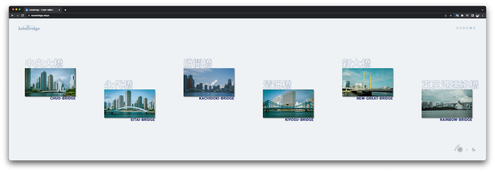
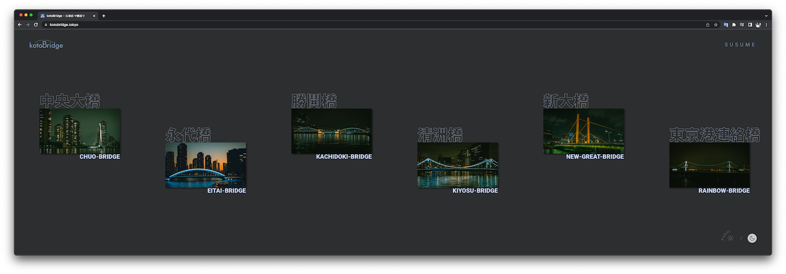
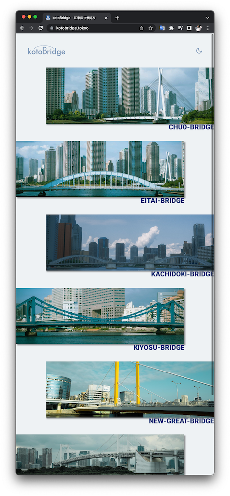
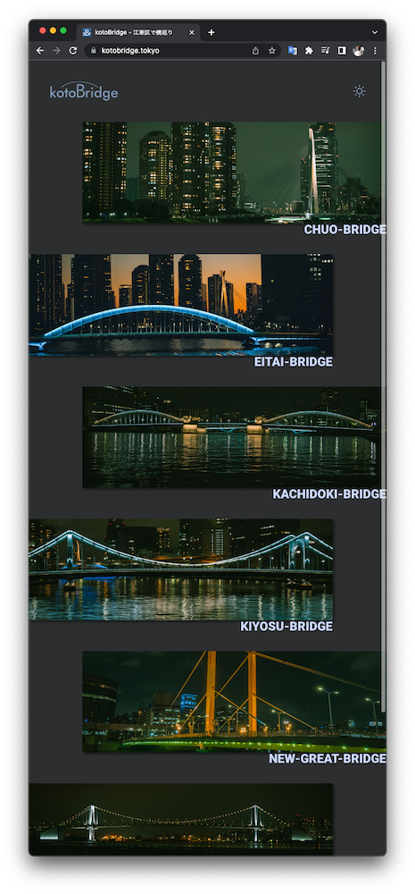
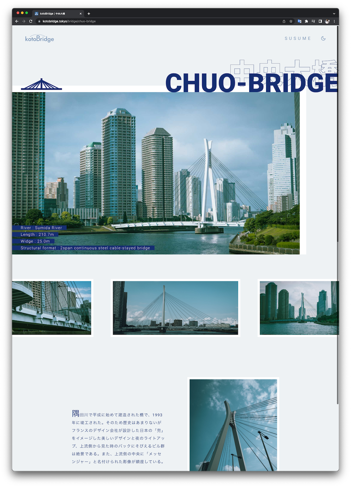
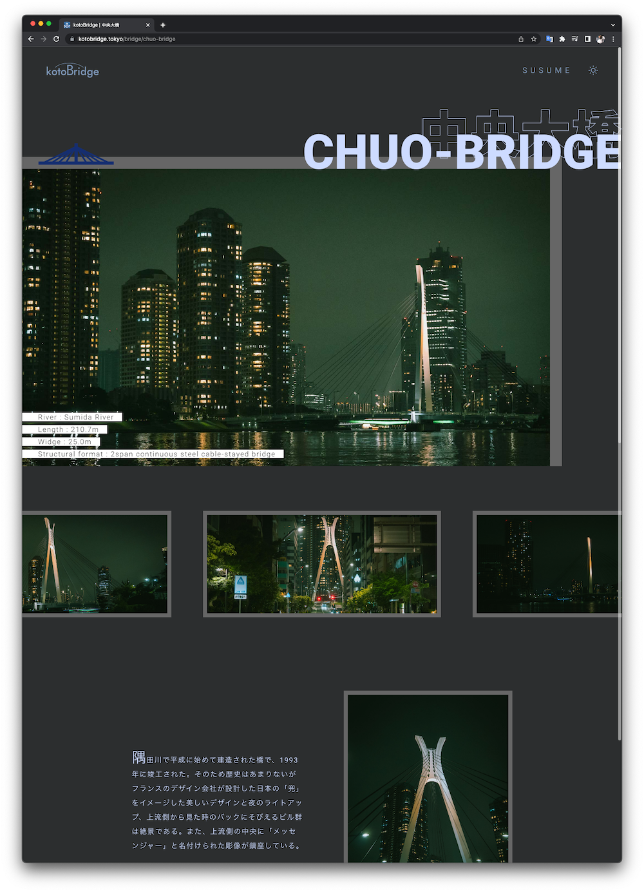

<div align="center">
   <h1><a href="https://kotobridge.tokyo">kotoBridge.tokyo</a></h1>
   <a href="./LICENSE"></a>
   <a href="../../search?l=javascript"></a>
   <a href="../../commits/main"></a>
   <a href="https://kotobridge.tokyo"></a>
   <a href="./package.json"></a>
   <a href="./package.json"></a>
   <p>
      <b>kotoBridge.tokyo</b> は、江東区の橋をビジュアル的に紹介するサイトである。<br/>
      indexページは横スクロールとなっており、<br/>
      <code>bridge-data</code>フォルダーに<code>.md</code>ファイルを追加することによって記事を増やすことができる。<br/>
      Leadersの課題として作成された。
   </p>
<div>

<table>
   <tr>
      <td width="60%">
         
         
      </td>
      <td>
         
      </td>
      <td>
         
      </td>
   </tr>
</table>
<table>
   <tr>
      <td></td>
      <td></td>
   </tr>
</table>

This is a [Next.js](https://nextjs.org/) project bootstrapped with [`create-next-app`](https://github.com/vercel/next.js/tree/canary/packages/create-next-app).

## Getting Started

First, run the development server:

```bash
npm run dev
# or
yarn dev
```

Open [http://localhost:3000](http://localhost:3000) with your browser to see the result.

You can start editing the page by modifying `pages/index.js`. The page auto-updates as you edit the file.

[API routes](https://nextjs.org/docs/api-routes/introduction) can be accessed on [http://localhost:3000/api/hello](http://localhost:3000/api/hello). This endpoint can be edited in `pages/api/hello.js`.

The `pages/api` directory is mapped to `/api/*`. Files in this directory are treated as [API routes](https://nextjs.org/docs/api-routes/introduction) instead of React pages.

## Learn More

To learn more about Next.js, take a look at the following resources:

-  [Next.js Documentation](https://nextjs.org/docs) - learn about Next.js features and API.
-  [Learn Next.js](https://nextjs.org/learn) - an interactive Next.js tutorial.

You can check out [the Next.js GitHub repository](https://github.com/vercel/next.js/) - your feedback and contributions are welcome!

## Deploy on Vercel

The easiest way to deploy your Next.js app is to use the [Vercel Platform](https://vercel.com/new?utm_medium=default-template&filter=next.js&utm_source=create-next-app&utm_campaign=create-next-app-readme) from the creators of Next.js.

Check out our [Next.js deployment documentation](https://nextjs.org/docs/deployment) for more details.
